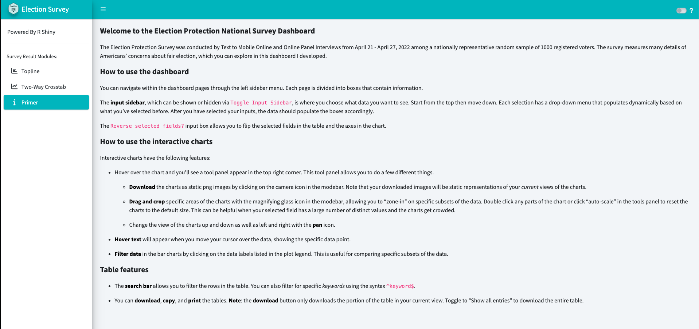
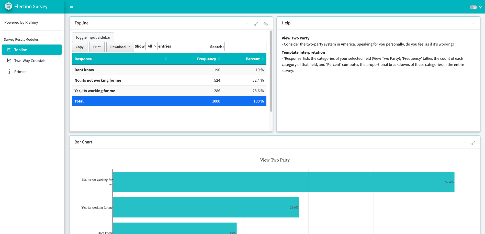
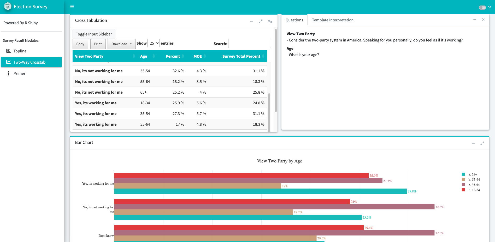

<!-- README.md is generated from README.Rmd. Please edit that file -->

# ElectProtect

<!-- badges: start -->

[](https://lifecycle.r-lib.org/articles/stages.html#stable)
<!-- badges: end -->

ElectProtect is a Shiny application built on the
[bs4Dash](https://rinterface.github.io/bs4Dash/) package.

## Dashboard Interface

### Primer



### Topline



### Cross-Tabulation



## Installation

You can install the development version of ElectProtect from Github
with:

``` r
# install.packages("devtools")
devtools::install_github("YangWu1227/elect-protect")
```

## Usage

The `database.sqlite` file is located in the `inst/extdata` directory.
The application can be run with the following code:

``` r
library(ElectProtect)

choice_list <- choices()
question_list <- questions()

# Instantiate database connection object ----------------------------------

db <- dbConnect(
  drv = SQLite(),
  dbname = app_sys("extdata", "database.sqlite")
)
onStop(fun = function() {
  dbDisconnect(db)
})

# Run application ---------------------------------------------------------

runApp(choice_list = choice_list, question_list = question_list, db = db)
```
